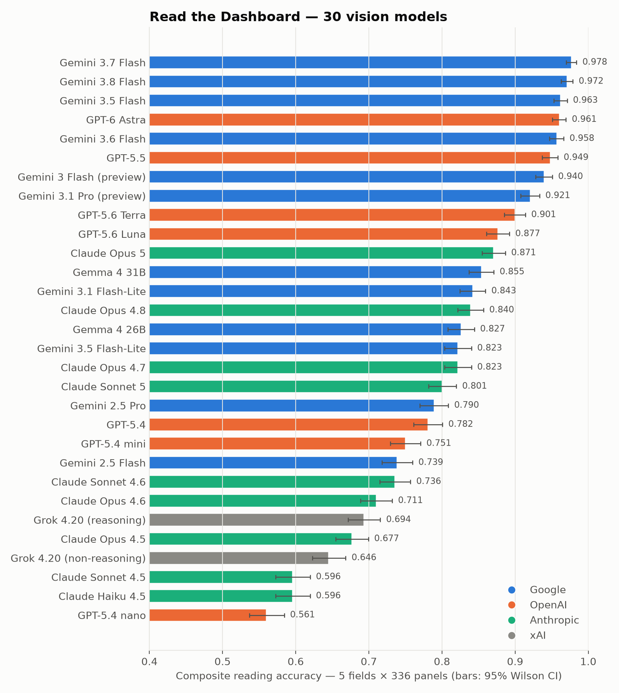
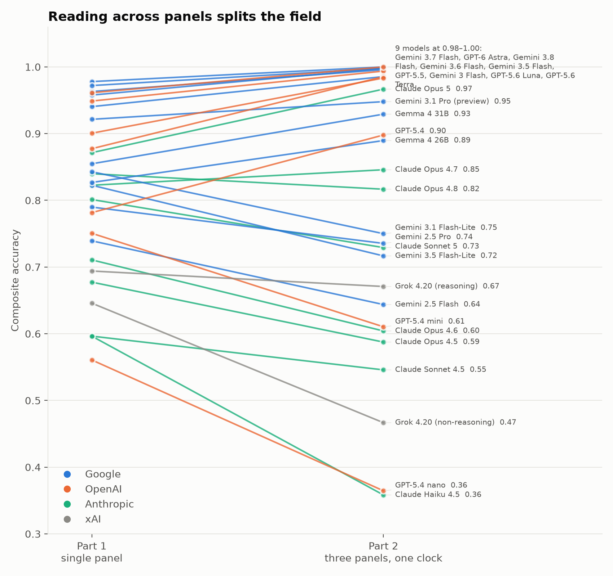

# Read the Dashboard

**Can an AI model read a monitoring panel the way an on-call engineer does?**

336 synthetic Grafana-style panels, each with an exact answer key, put to 30 vision models on [Kaggle Benchmarks](https://www.kaggle.com/benchmarks). For each panel the model reports five facts an engineer would act on: what happened, when it started, which deploy lines up with it, whether it is recovering, and the peak value.



| | |
|---|---|
| Kaggle benchmark | https://www.kaggle.com/benchmarks/yaroslavperventsev/read-the-dashboard |
| Kaggle task | https://www.kaggle.com/benchmarks/tasks/yaroslavperventsev/read-the-dashboard |
| Kaggle dataset (panels + answer key) | https://www.kaggle.com/datasets/yaroslavperventsev/read-the-dashboard-panels |
| Write-up | https://dev.to/uptimearchitect/i-showed-30-ai-models-336-monitoring-dashboards-most-of-them-cant-tell-time-h0m |

## Headline results (task v7)

| Model | Score | Cost per 336-panel run |
|---|---|---|
| Gemini 3.7 Flash | 0.978 | $1.51 |
| Gemini 3.8 Flash | 0.972 | $4.15 |
| Gemini 3.5 Flash | 0.963 | $4.53 |
| GPT-6 Astra | 0.961 | $7.23 |
| Claude Opus 5 | 0.871 | $5.41 |
| GPT-5.4 nano | 0.561 | $0.10 |

All 30 models, per field: [`results/v7_final_leaderboard.csv`](results/v7_final_leaderboard.csv). Every individual answer: [`results/per_panel_answers_v7.csv`](results/per_panel_answers_v7.csv).

## Part 2: multi-panel incidents (added Oct 3)

120 synthetic incidents, each three stacked panels (p99 latency, error rate, CPU) for one service on a shared clock. Two or three signals change, 8–20 minutes apart. The model reports which signal moved first, the full order, the start time (±3 min) and the implicated deploy.



Ten models score 0.97–1.00 on Part 2, higher than on single panels; the rest drop by up to 0.24, mostly by losing the order of events. Results: [`results/part2_leaderboard.csv`](results/part2_leaderboard.csv), answers: [`results/part2_per_incident_answers.csv`](results/part2_per_incident_answers.csv). Claude Sonnet 4.6 was rate-limited by the provider on all six attempts and is excluded from the Part 2 comparison.

| | |
|---|---|
| Part 2 task | https://www.kaggle.com/benchmarks/tasks/yaroslavperventsev/read-the-dashboard-incidents |
| Part 2 dataset | https://www.kaggle.com/datasets/yaroslavperventsev/read-the-dashboard-incidents |

## What is graded

| Field | Graded as |
|---|---|
| Event type (step change, ramp, spike, flapping, plateau, gap, none) | exact match |
| Start time read off the x-axis | within ±2 min (±6 for ramps) |
| Implicated deploy marker (A/B/C/none) | exact match |
| Recovering by the right edge | exact match |
| Peak value in axis units | within ±10% |

The score is the mean of the five fields. Two canary fields (y-axis label, number of dashed markers) detect models that cannot see the image and are not part of the score.

## Repository layout

| Path | What it is |
|---|---|
| `gen/incidents.py`, `task/incidents.py` | Part 2 generator (seed 7) and Kaggle task. |
| `gen/panels.py` | Panel generator. Seed 2026 reproduces the 336 images byte-for-byte. Labels are derived from the rendered data and self-checked. |
| `task/read_the_dashboard.py` | The Kaggle Benchmarks task (`kaggle-benchmarks` SDK). |
| `analysis/` | Result collection, report, charts, and the quota-aware run orchestrator. |
| `data/manifest.csv` | Answer key and trap flags for every panel. |
| `results/` | Final leaderboard, per-panel answers, resolution split, start-time analysis, robustness check, repeat variance. |
| `img/` | Charts used in the write-up. |

## Reproduce

```bash
pip install kaggle-benchmarks kaggle matplotlib pandas numpy
python gen/panels.py --out data/full --n 336 --seed 2026 --balanced
kaggle b init -y
kaggle b t push read-the-dashboard -f task/read_the_dashboard.py -d <your-dataset>
kaggle b t run read-the-dashboard -m gemini-3.7-flash
```

## Notes

- **Answer-key audit.** An earlier version of the key had 32 panels where the top models agreed with each other and disagreed with the key (hidden gaps, invisible ramp onsets, ambiguous recovery). The generator was rebuilt to derive every label from the rendered data, and all models were re-run. The remaining ambiguity, when a gradual ramp starts, is quantified in `results/v7_ramp_robustness.csv` and moves the ranking by at most two places.
- **Quota.** Kaggle's model proxy reserves worst-case cost per call before running it. The task caps output at 16,384 tokens per panel (`extra_api_params={"max_tokens": ...}`), which is above every model's 99th percentile.

## License

Code: MIT. Panels, answer key and results: CC0 1.0.
